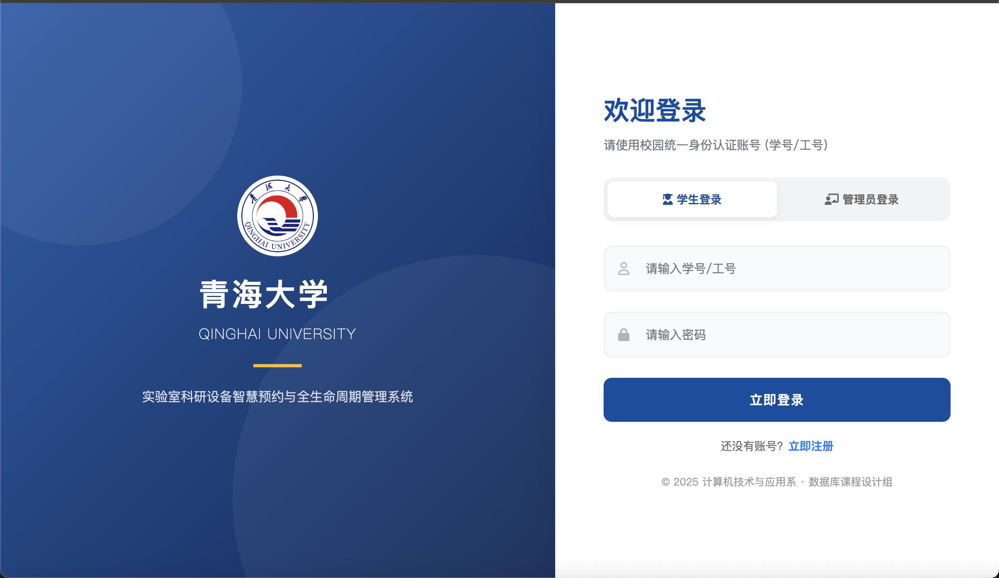

# 青海大学灵犀智约平台

# QHU i-Lab

> **课程设计题目**：《数据库技术及其应用》综合设计
>
> **学院**：计算机技术与应用系
>
> **组号**：High-polymer




## 📖 项目介绍

针对 QHU 高性能计算中心、智能计算实验室等科研场所面临的 **设备预约冲突、机房排课管理复杂、设备维护信息不透明** 等痛点，本项目设计并开发了一套 **基于 RESTful API 的前后端分离** 智慧管理系统。

系统采用了 **Python Flask** 作为后端服务，**Microsoft SQL Server** 作为数据中心，实现了从用户注册登录、设备实时状态查询、防冲突时间段预约到我的申请管理的全流程功能。特别针对科研设备（如 GPU 节点）实施了精确的时间段网格化管理，有效解决了并发预约冲突问题。

## ✨ 主要功能

### 🧑‍🎓 用户端（学生/教师）

1. **可视化仪表盘 (Dynamic Dashboard)**：
   * **动态数据驱动**：实时调用后端接口，精准展示实验室资源概况（设备总数、当前可用数、今日预约数、待维修数），数据与数据库实时同步，**告别静态死数据**。
   * 动态图表展示各学院设备活跃度（CSS 原生绘制）。

2. **科研设备预约（核心功能）**：
   * **时间段网格化**：放弃传统的文本输入，采用 08:00-10:00 等标准时间段选择。
   * **实时冲突检测**：点击日期时，系统自动查询数据库，**自动置灰/禁用**已被占用的时间段，从根源上杜绝撞单。
   * **状态智能联动**：当设备处于“维修中”状态时，预约按钮自动变更为“暂停预约”并禁用，防止无效申请。

3. **计算机房/自习室查询**：
   * 查看机房（121, 223 等）的开放状态及位置信息。

4. **全流程账户体系**：
   * 支持 **实名注册**（学号、姓名、院系），数据直接写入 SQL Server。
   * 安全登录校验，区分用户角色（Student/Admin）。

5. **我的申请管理**：
   * 实时拉取个人历史预约记录，查看审批状态。
   * **自主取消功能**：学生可在“我的申请”列表中对未完成的预约进行**取消操作**，释放资源给其他同学。

6. **故障报修**：
   * 在线填写报修单，支持紧急程度分级。
   * **防重复提交机制**：系统会在提交前自动检测该设备是否存在“待处理”的报修单，若存在则拦截提交并提示，避免重复派单。

### 👨‍🏫 后端与数据库特性

1. **RESTful API 设计**：通过 JSON 格式进行前后端数据交互。
2. **原生 SQL 交互**：不依赖重型 ORM 框架，使用 `pymssql` 直接执行 T-SQL 语句，保证查询效率与灵活性。
3. **数据库级约束**：利用 SQL Server 的 `UNIQUE` 约束确保数据一致性。

### 👨‍🏫 管理员端

1. **报修处理闭环**：
   * 接收学生报修 -> 标记设备为“维修中” (自动阻断新预约) -> 线下维修 -> 点击“完成修复” -> 设备自动恢复“可用”。

2. **设备入库管理**：标准化的资产录入界面（演示版）。

3. **数据看板**：实时监控设备完好率及待处理事项。

---

## 💻 技术栈 (Tech Stack)

| 类型 | 名称 | 说明 |
| :--- | :--- | :--- |
| **前端** | HTML5, CSS3, JS (ES6+) | 原生开发，无重型框架依赖，集成 FontAwesome 图标库 |
| **后端** | Python 3.8+, Flask | 提供 RESTful API 接口，处理跨域 (CORS) 与业务逻辑 |
| **数据库** | **Microsoft SQL Server** | 企业级关系型数据库，存储用户、设备及预约数据 |
| **驱动库** | **pymssql** | Python 连接 SQL Server 的轻量级驱动 |
| **交互协议** | HTTP / JSON | 前后端分离的标准通讯格式 |
| **开发工具** | PyCharm / VS Code | 代码编写与调试环境 |
| **版本控制** | Git / GitHub | 代码版本管理 |

---


## 🚀 安装与运行指南
### 1. 环境准备
确保您的电脑已安装：
* **Python 3.8** 或更高版本
* **Microsoft SQL Server** (2008 R2 / 2012 / 2019 等版本均可)

### 2. 克隆项目与安装依赖

```bash
git clone [[https://github.com/High-ploymer/QHU-i-Lab.git]]
cd QHU-i-Lab

# 安装 Flask, pymssql 和 flask-cors
pip install -r requirements.txt
# 或者直接运行：
pip install flask flask-cors pymssql
```


### 3. 数据库初始化
1. 打开 **SQL Server Management Studio (SSMS)**。
2. 创建新数据库 `qhu_lab_system`。
3. 打开项目中的 `db_schema.sql` (或复制相关 SQL 语句)。
4. 执行脚本，创建 `Users`, `Equipments`, `Labs`, `Bookings` 等表。

### 4. 配置后端连接
打开 `app.py`，找到 `DB_CONFIG` 配置项，修改为您本机的数据库信息：

```python
DB_CONFIG = {
    'server': '192.168.x.x',   # 您的数据库 IP 或 'localhost'
    'port': '1433',            # SQL Server 默认端口
    'user': 'sa',              # 数据库账号
    'password': 'your_password', # 数据库密码
    'database': 'qhu_lab_system',
    'charset': 'utf8'
}
```
### 5. 启动项目

**步骤一：启动后端**
在终端执行：

```bash
python app.py
```
看到 Running on http://127.0.0.1:5000 即表示后端服务启动成功。

步骤二：运行前端 
直接双击打开 `front.html`，或者在浏览器地址栏输入文件路径。
**（建议使用 VS Code 的 "Live Server" 插件运行 index.html 以获得更好的体验）**

项目启动后，即可操作运行

## 📖 使用说明
### 默认管理员：

**账号**：admin

**密码**：123456 (首次登录请务必修改密码)

### 注册用户：

1. 系统默认为游客状态，需点击“立即注册”创建账号（学号作为唯一登录凭证）。

2. 注册成功后，使用学号和密码登录进入系统。
### 预约流程：
```text
登录系统 -> 点击“设备列表”。

选择设备 -> 点击“立即预约”。

选择时间段 -> 提交申请。

等待管理员审核（或自动通过，视设置而定）。
```

## ❓ 常见问题解答 (FAQ)

### Q1: 启动报错 "ModuleNotFoundError: No module named 'flask'"?

Fix: 请检查是否已成功激活虚拟环境，并执行了 **pip install -r requirements.txt**。

### Q2: 数据库报错 "sqlalchemy.exc.OperationalError ... Access denied"?

Fix: 请检查 **config.py** 中的数据库用户名和密码是否正确，以及 MySQL 服务是否已启动。

### Q3: 迁移时提示 "Target database is not up to date"?

Fix: 请尝试执行 **flask db stamp head** 然后再次运行 **flask db migrate** 和 **flask db upgrade**。

### Q4: 表格显示 "Invalid column name"?

Fix: 可能是模型定义改变但未迁移数据库。请重新执行数据库迁移命令。

### Q5: 中文显示乱码?

Fix: 请确保 config.py 中数据库 URI 包含 ?charset=utf8mb4，且 Python 文件头部包含 **# -*- coding: utf-8 -*-**。

## 👥 项目分工
组长：统筹项目进度，负责后端核心架构与数据库设计。

组员A：负责前端页面设计与实现 (UI/UX)。

组员B：负责部分业务逻辑开发与文档编写。


---
© 2025 QHU Lab System. All Rights Reserved.